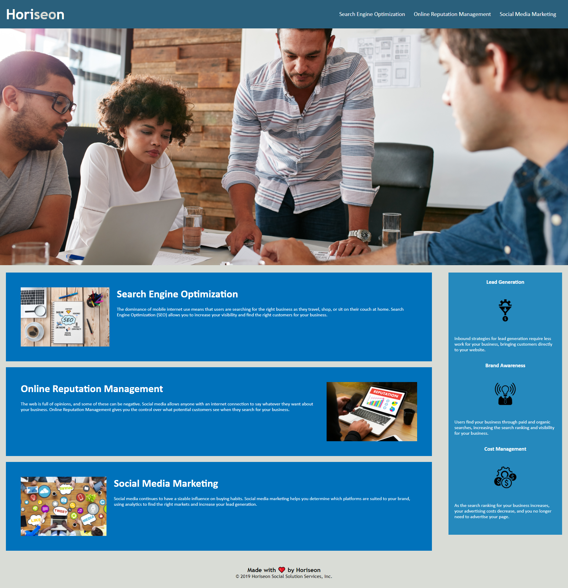

# Accessibility Standards Update to Horizen's Codebase
 [](https://open.vscode.dev/microsoft/vscode)
 
## Updates to the **HTML** Code
This project updated the Accessibility Standards to Horizen's existing codebase. Although the HTML was working perfectly it included many `<div>` elements that would not allow assistive technologies like video captions, screen readers, and braille keyboards to work properly. The Semantic HTML Structure corrected and added were:

```
* Updated the Title content to better describe the application
* Corrected the Head order sequence
* Replacing the Content Division elements for more descriptive elements that better define different parts of the application
* Adding alternative text description to images and Label to icon
```

This project gave me the opportunity to learn more about Semantic HTML Structure. Using the research, I found about HTML Structure and what we've learned in class I was able to make the necessary edits to the codebase, leaving it a little cleaner than how I found it.

## Updates to the **CSS** Code
Updating the applications HTML code to specific elements instead of `<div>` required updates to the CSS code in order to keep specific selectors working. The code was also extensive and repetitive selectors were condensed. In order to give this application long-term sustainability, the following changes were made to the CSS codebase:

```
* The selectors for the Sections and Articles were condensed
* The Content Division selectors were updated to Navigation
* The order was slightly reorganized to follow the HTML semantic structure
```

While researching CSS semantic structure I learned it really doesn't have a specific framework but lots of definite don'ts and many good rules. Using those rules and what I learned in class I focused on condensing the selectors and adding comments to the changes I made.

## README File
There were no updates to the applications README file but this is the first time I have ever created one. I had known a bit about coding before this course but never about README files. After reading the suggested *Professional README Guide* our professor recommended I have gained an appreciation and understanding for their use.  

## Application Screen Capture
The following image shows the current application after the updates to the codebase.



> **Note**: You can find the deployed application here&mdash;https://lafc2018.github.io/Homework-Assignment-1/

## Resources Used
* [GitHub](http://github.com)
* [MDN Web Docs](https://developer.mozilla.org)
* [W3 Schools](https://www.w3schools.com/)
* [Request-Response](https://coding-boot-camp.github.io/full-stack/github/professional-readme-guide)